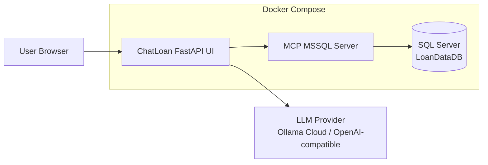

# ChatLoan Agentic MCP

Minimal loan Q&A demo that connects a FastAPI chat UI to an MCP server for read-only SQL Server loan data queries. The app uses an LLM provider, defaults to Ollama Cloud, and answers through MCP tools backed by the restored `LoanDataDB` database.

## Tech Stack

- Python 3.11, FastAPI, Jinja2
- OpenAI-compatible SDK client for LLM providers
- MCP Python SDK
- SQL Server 2022 with ODBC Driver 18
- Docker Compose
- HTML, CSS, vanilla JavaScript

## Disclaimer

This project is for demo and local development only. Loan data is test data. Do not commit real API keys, production database backups, or customer data.

## Architecture



## How To Run

1. Create the app environment file:

```powershell
Copy-Item agenticai_v2\.env.example agenticai_v2\.env
```

2. Edit `agenticai_v2/.env` and set your provider key, for example:

```env
LLM_PROVIDER=ollama_cloud
OLLAMA_API_KEY=your_api_key
OLLAMA_MODEL=gpt-oss:120b
```

3. Build and start the stack:

```powershell
docker compose up --build -d
```

4. Open the app:

```text
http://localhost:5082
```

Useful commands:

```powershell
docker compose ps
docker compose logs -f agenticai-v2
docker compose down
```
