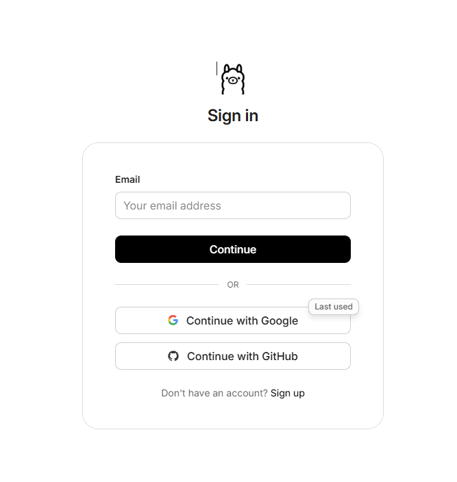
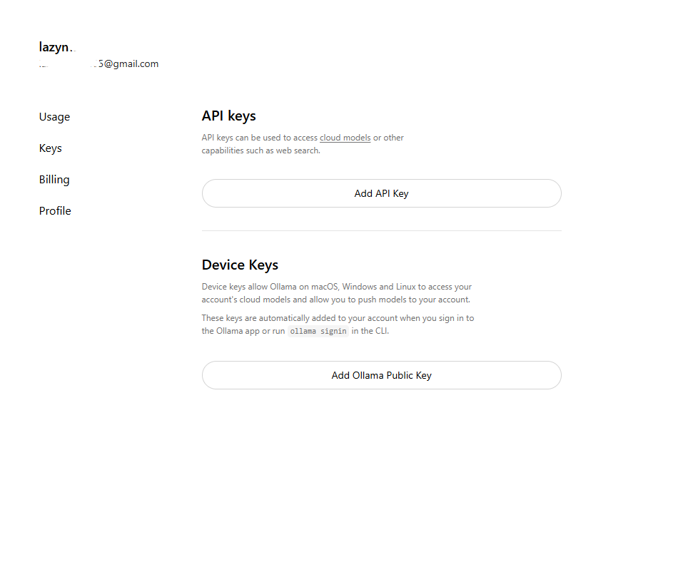
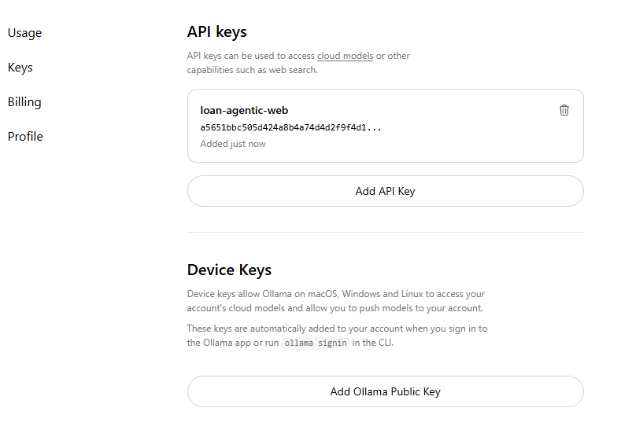
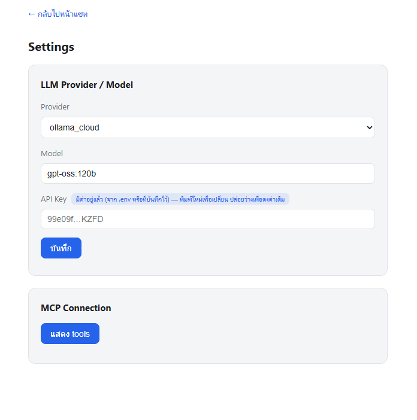
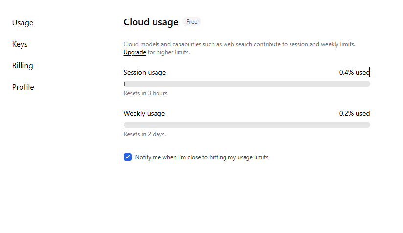

# วิธีขอ API Key: Ollama Cloud

ทำตามขั้นตอนสั้น ๆ นี้เพื่อใช้งาน Ollama Cloud กับ ChatLoan

1. เข้าเว็บ [ollama.com](https://ollama.com/) แล้วลงชื่อเข้าใช้

2. เปิดหน้า [API Keys](https://ollama.com/settings/keys) แล้วกดสร้าง key ใหม่

3. คัดลอก API key ที่ได้ เก็บไว้ให้ปลอดภัย เพราะมักจะแสดงเต็มเพียงครั้งเดียว

4. กลับมาหน้า Settings ของ ChatLoan เลือก provider `ollama_cloud` แล้ววาง key ในช่อง API Key

5. กดบันทึก แล้วกลับไปหน้าแชทเพื่อใช้งาน model `gpt-oss:120b`

เอกสารอ้างอิง:

- [Ollama Cloud](https://docs.ollama.com/cloud)
- [Ollama API Authentication](https://docs.ollama.com/api/authentication)
